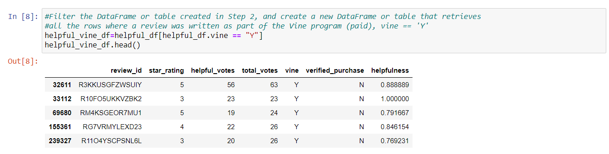
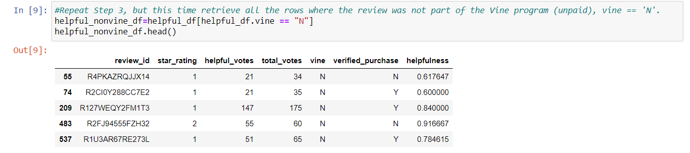
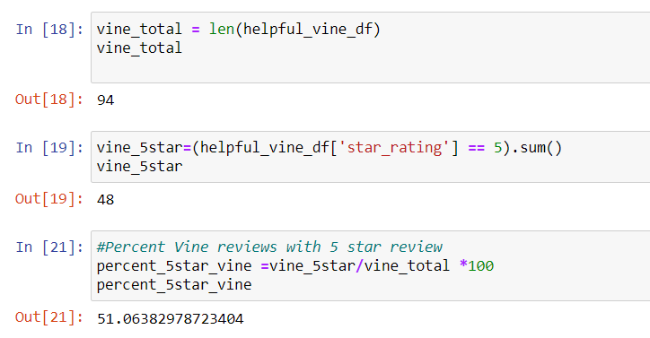
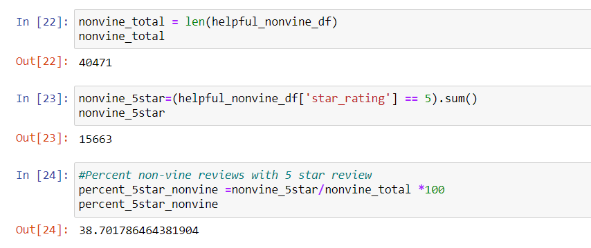
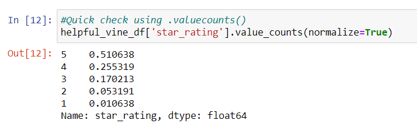
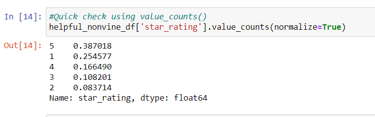

# Amazon Vine Analysis 
## *Is there a positivity bias with paid reviews?*

## Overview
- We are analyzing Amazon reviews written by members of the paid Amazon Vine program. The Amazon Vine program is a service that allows manufacturers and publishers to receive reviews for their products. Companies pay a small fee to Amazon and provide products to Amazon Vine members, who are then required to publish a review.
**We are aiming to determine if there is any bias toward favorable reviews from Vine members in a given dataset.**
- Using the cloud ETL process, we have created an AWS RDS database with tables in pgAdmin,  we have taken an Amazon "Video Game" Review dataset, and extracted into a DataFrame. We transformed the DataFrame into four separate DataFrames that match a table schema we created in pgAdmin, and then uploaded our transformed data.
- From here we exported a table as a csv file and used Pandas to filter the df to find a collection of reviews that are form vine members and a collection from non-vine members. We then calculated the percentage of five-star reviews given in each of these sets. 

## Resources
AWS, PG admin, PySpark, Google colab, Pandas lib., Jupyter notebook.

## Results
[ETL code](Amazon_Reviews_ETL.ipynb)

[Vine review analysis code](Vine_Review_Analysis.ipynb)
- First I filtered to get reviews that have a least 20 reader votes, 50% or more of which are stating the review is helpful.

- I then split this data frame into two. One data frame containing vine user reviews,

 

 and one for non-Vine reviews. 
 

 - I am then able obtain the following numbers for **vine reviews**.
    - Total count = 94
    - Five Star ratings = 48
    - Percentage of  reviews five star = 51.06 %

- For **non-Vine** reviews the results are:
    - Total count = 40471
    - Five Star rating = 15663
    - Percentage of reviews five star = 38.7%

- I then used .value_counts() to check these results, and have a look at what the numbers would look like for other star ratings.

## Summary

 - **We can see that with this data set it does appear that there is a positivity bias for paid reviews.** 51% of Vine reviews were 5-star whereas  39% of non-Vine reviews were 5-star.    

- We can learn more by looking beyond 5-star reviews. Using value_counts(normalize=True), I was able to see more evidence for favorable reviews from Vine users. We can see that the second most often given review for Vine members is 4-star with 26% whereas with non-Vine users it is 1-star with 25%.  Vine users only gave out 1-star reviews one percent of the time.

 - I would like to check these findings across different product review datasets.

 - It may also be interesting to run a t-test to see if we have a statistical difference between population means.

